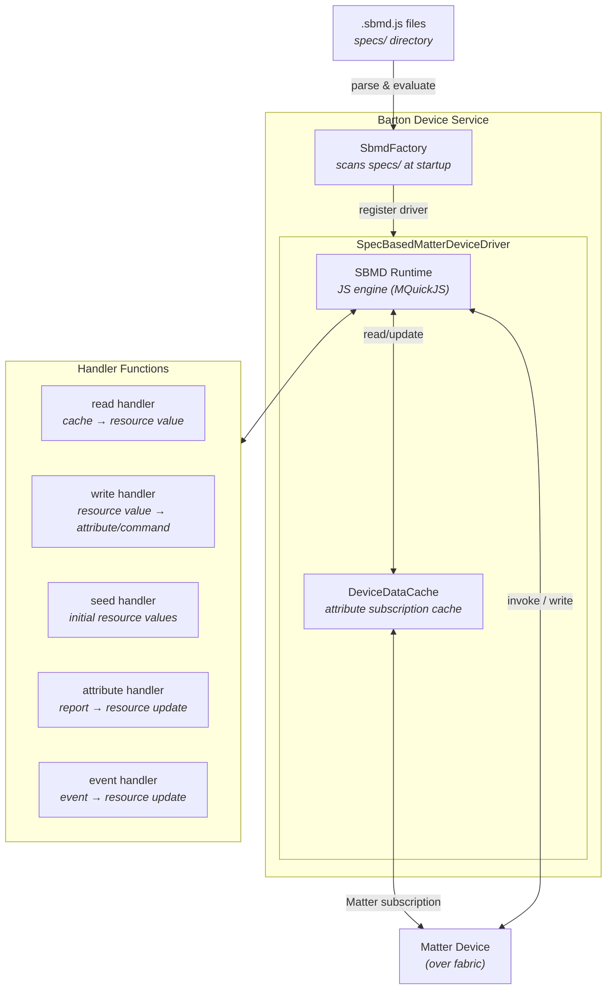

# Specification-Based Matter Drivers (SBMD) — v4.0

## 1. Introduction

Specification-Based Matter Drivers (SBMD) is a device driver framework that enables
Barton to support Matter devices through JavaScript specification files rather than
compiled C/C++ code. Each `.sbmd.js` file is a self-contained driver that declares
metadata, resources, endpoints, and handler functions in a single registration call.

SBMD eliminates the need to write per-device-type native C/C++ drivers. New Matter
device types can be supported by adding a specification file — no firmware rebuild
or redeployment required.

### 1.1 Goals

- **Single-file drivers**: One `.sbmd.js` file fully defines a device driver —
  metadata, resource declarations, device-side handler registrations, and all
  handler implementations.
- **No `var` in driver scope**: Driver authors never allocate global mutable state or
  file-scoped vars. Constants are declared in a `constants` block and injected as
  read-only globals by the runtime. Local variables within handler functions may use
  `var` for short-lived temporaries confined to the handler invocation. This is to
  prevent difficult-to-control dynamic memory usage which can cause resource exhaustion.
- **Declarative resource model**: Resources declare their type, access modes, and
  optional seed/read/write/execute handlers. The runtime manages caching, event
  emission, and lifecycle.
- **Bidirectional device interaction**: Cleanly separate Barton-initiated operations
  (resource reads, writes, executes) from device-initiated data (attribute reports,
  events, command responses).
- **Composable results**: Handler functions return an immutable result object built
  via `SbmdUtils.result()` that can atomically express multiple operations
  (resource updates, device invocations, logging, persistent storage).

### 1.2 Historical Context

Barton device drivers bridge Barton's resource-based device data model to
device-specific interfaces like Matter and Zigbee. Historically, these drivers
have been written in C/C++.

The idea of specification-driven device drivers originated around 2015 for Zigbee
driver authoring. Complexities with proprietary message timing shelved that effort,
but the concept resurfaced with Matter, where writing custom native code for each
supported device type adds too much friction to the goal of broad device support.

SBMD addresses this by using textual specification files that map between Matter
types and Barton resources, enabling new device type support without rebuilding or
redeploying firmware. v1–v3 used declarative YAML specifications with embedded
JavaScript mapper scripts. v4.0 consolidates everything into single `.sbmd.js`
files where the full driver — metadata, resources, and handler logic — is expressed
in JavaScript.

### 1.3 File Layout

```
core/deviceDrivers/matter/sbmd/specs/
  light.sbmd.js
  door-lock.sbmd.js
  thermostat.sbmd.js
  contact-sensor.sbmd.js
  ...
```

Each file is evaluated by the C runtime's embedded JavaScript engine (e.g., MQuickJS).
The runtime provides `SbmdDriver()`, `SbmdUtils`, and injected constants as globals
before evaluation.

---

## 2. Architecture

### 2.1 Overview

SBMD sits between Barton's resource-based device model and the Matter protocol
layer. Each `.sbmd.js` driver file is loaded at startup by the SBMD factory,
evaluated in a sandboxed JavaScript engine, and registered as a device driver.
When a Matter device is commissioned, a two-pass claiming process selects the
best-matching driver. At runtime, the driver's handler functions translate
between Barton resource operations and Matter attribute/command interactions.



### 2.2 Key Components

| Component | Description |
|---|---|
| **SbmdFactory** | Scans the `specs/` directory at startup, evaluates each `.sbmd.js` file, and registers a driver instance per file. |
| **SpecBasedMatterDeviceDriver** | The device driver implementation that uses a parsed SBMD registration to handle Barton resource operations and Matter device interactions. |
| **SBMD Runtime** | Sandboxed JavaScript engine (MQuickJS) that evaluates driver files and dispatches handler calls. Provides `SbmdDriver()`, `SbmdUtils`, and injected constants as globals. |
| **DeviceDataCache** | Per-device attribute cache kept current via Matter subscriptions. Handlers read from this cache for current device state. |
| **Handler functions** | Plain JavaScript functions authored in the `.sbmd.js` file that translate between Barton and Matter representations. |

### 2.3 Data Flow

1. **Startup**: `SbmdFactory` scans the specs directory and evaluates each `.sbmd.js`
   file. The runtime performs a two-pass evaluation: first extracting constants,
   then evaluating the full file with constants injected as read-only globals.
2. **Registration**: Each `SbmdDriver()` call registers a driver with its metadata,
   resource declarations, and handler functions.
3. **Device claiming**: When a Matter device is commissioned, a two-pass process
   selects the driver: vendor-specific drivers (matched by `vendorId`/`productId`)
   are tried first, then generic device-type drivers.
4. **Resource binding**: The driver creates Barton resources based on the endpoint
   and resource declarations, gated by alias prerequisites.
5. **Runtime operations**:
   - **Attribute report** → attribute handler → result builder → resource update
   - **Resource read** → read handler (with [supplements](#412-supplements)) → result builder → value
   - **Resource write** → write handler → result builder → Matter attribute write or command invoke
   - **Resource execute** → execute handler → result builder → Matter command invoke
   - **Event** → event handler → result builder → resource update

---

## 3. File Structure

Every `.sbmd.js` file has two sections:

1. **Registration object** — a single `SbmdDriver({...})` call containing all
   declarative metadata.
2. **Handler functions** — plain JavaScript functions referenced by the
   registration object.

```js
SbmdDriver({
  schemaVersion: "4.0",
  driverVersion: "1.0",
  name: "...",
  constants:         { ... },
  aliases:           { ... },
  barton:            { ... },
  matter:            { ... },
  reporting:         { ... },
  resources:         { ... },       // device-level resources
  endpoints:         { ... },       // endpoint-scoped resources
  attributeHandlers: { ... },       // incoming attribute reports
  eventHandlers:     { ... },       // incoming events
  commandHandlers:   { ... },       // incoming (unsolicited) commands
});

// Handler function implementations below
function myHandler(args) { ... }
```

---

## 4. Registration Object Schema

### 4.1 Top-Level Fields

| Field | Type | Required | Description |
|---|---|---|---|
| `schemaVersion` | string | yes | Schema version. Currently `"4.0"`. |
| `driverVersion` | string | yes | Driver-specific version string. |
| `name` | string | yes | Human-readable driver name. |
| `constants` | object | yes | Named constants (see [4.2](#42-constants)). |
| `aliases` | object | no | Named references to Matter cluster attributes and events (see [4.3](#43-aliases)). |
| `barton` | object | yes | Barton device class mapping (see [4.4](#44-barton)). |
| `matter` | object | yes | Matter device type matching (see [4.5](#45-matter)). |
| `reporting` | object | no | Attribute reporting interval (see [4.6](#46-reporting)). |
| `resources` | object | no | Device-level resources (see [4.7](#47-resources)). |
| `endpoints` | object | no | Endpoint definitions (see [4.8](#48-endpoints)). |
| `attributeHandlers` | object | no | Attribute report handlers (see [4.9](#49-attribute-handlers)). |
| `eventHandlers` | object | no | Event handlers (see [4.10](#410-event-handlers)). |
| `commandHandlers` | object | no | Unsolicited command handlers (see [4.11](#411-command-handlers)). |

### 4.2 Constants

```js
constants: {
  EP_LIGHT: "1",
  CL_ON_OFF: 0x0006,
  ATTR_ON_OFF: 0x0000,
  CMD_ON: 0x0001,
  CMD_OFF: 0x0000,
  RES_IS_ON: "isOn",
}
```

Constants must be **primitive literals** (numbers, strings, booleans). No
expressions, function calls, or object references.

**Runtime behavior**: Before evaluating the file, the runtime extracts the
`constants` block and injects each entry as a **read-only global variable** on
the JavaScript execution context. This means bare constant names resolve
everywhere in the file — inside the `SbmdDriver({...})` object literal, in
handler functions, and in helper functions.

**Naming convention**: `UPPER_SNAKE_CASE`. Use prefixes to group by purpose:
- `ATTR_*` — Matter attribute IDs
- `EVT_*` — Matter event IDs
- `CMD_*` — Matter command IDs
- `RES_*` — Barton resource names
- `EP_*` — Matter endpoint IDs (string)
- `CL_*` — Matter cluster IDs

### 4.3 Aliases

Aliases define **named references** to Matter cluster attributes, events, and
commands. They provide a single place to declare cluster+ID pairs that can be
referenced by name in prerequisites, supplements, and handler registrations.

```js
aliases: {
  lockState: {
    clusterId: CL_DOOR_LOCK,
    attributeId: ATTR_LOCK_STATE,
    type: "DlLockState",
  },
  lockOperation: {
    clusterId: CL_DOOR_LOCK,
    eventId: EVT_LOCK_OPERATION,
  },
  getCredentialStatusResp: {
    clusterId: CL_DOOR_LOCK,
    commandId: CMD_GET_CREDENTIAL_STATUS_RESP,
  },
  currentLevel: {
    clusterId: CL_LEVEL_CONTROL,
    attributeId: ATTR_CURRENT_LEVEL,
    type: "uint8",
  },
}
```

Each alias declares a `clusterId` and exactly one of `attributeId`, `eventId`,
or `commandId`:

| Field | Type | Required | Description |
|---|---|---|---|
| `clusterId` | number | yes | Matter cluster ID. |
| `attributeId` | number | conditional | Attribute ID. Mutually exclusive with `eventId` and `commandId`. |
| `eventId` | number | conditional | Event ID. Mutually exclusive with `attributeId` and `commandId`. |
| `commandId` | number | conditional | Command ID. Mutually exclusive with `attributeId` and `eventId`. |
| `type` | string | no | Matter data type (documentation only, ignored by runtime). |

Aliases serve three purposes:

1. **Prerequisite gates**: Resources list alias names in their `prerequisites`
   array. Before registering the resource, the runtime checks that the
   referenced Matter element is present on the device (see
   [4.8.1 Resource Declaration](#481-resource-declaration)).
2. **Supplement references**: Supplement `attributes` arrays reference aliases
   by name. The runtime resolves each alias to its cluster+attribute pair,
   fetches the value, and delivers it to the handler keyed by alias name
   in `args.supplements.attributes` (see [4.12 Supplements](#412-supplements)).
3. **Handler dispatch**: Attribute, event, and command handlers can specify
   `aliases` (an array) instead of `clusterId` + ID fields. The runtime
   resolves each alias to determine the trigger. A single handler can match
   multiple aliases (see [4.9](#49-attribute-handlers),
   [4.10](#410-event-handlers), [4.11](#411-command-handlers)).

The check performed depends on the alias type:

| Alias type | Check performed |
|---|---|
| Attribute alias (`attributeId`) | Cluster **and** attribute must be present in the device's data cache. |
| Event alias (`eventId`) | Cluster must be present in the device's data cache. |

> **Note**: Event alias prerequisites can only confirm that the cluster exists —
> they cannot verify that the specific event ID is supported, because the Matter
> `EventList` global attribute is provisional and not reliably present on real
> devices.

### 4.4 Barton

```js
barton: {
  deviceClass: "doorLock",
  deviceClassVersion: 3,
}
```

| Field | Type | Required | Description |
|---|---|---|---|
| `deviceClass` | string | yes | Barton device class identifier. |
| `deviceClassVersion` | number | yes | Version of the device class schema. |

### 4.5 Matter

```js
matter: {
  deviceTypes: [0x000a],
  revision: 1,
  featureClusters: [CL_DOOR_LOCK],
}
```

| Field | Type | Required | Description |
|---|---|---|---|
| `deviceTypes` | number[] | yes | Matter device type IDs this driver handles. |
| `revision` | number | no | Minimum Matter device type revision required. |
| `vendorId` | number | no | Matter vendor ID for vendor-specific matching. |
| `productId` | number | no | Matter product ID for vendor-specific matching. Requires `vendorId`. |
| `featureClusters` | number[] | no | Cluster IDs whose feature maps should be cached and made available to handlers via `args.clusterFeatureMaps`. |

**Driver claiming**: When a Matter device is commissioned, the runtime uses a
two-pass claiming process to select the driver:

1. **Vendor-specific pass**: Drivers that declare `vendorId` and `productId` are
   tried first. A driver matches if the device's vendor ID, product ID, **and**
   at least one `deviceTypes` entry all match.
2. **Generic pass**: Drivers without `vendorId`/`productId` are tried next,
   matched by `deviceTypes` alone.

This allows a vendor-specific driver to override the generic behavior for a
particular device while still sharing the same device type.

```js
// Vendor-specific driver example
matter: {
  vendorId: 0x117C,              // IKEA
  productId: 0x8005,             // TIMMERFLOTTE
  deviceTypes: [0x0302, 0x0307], // Temperature + Humidity Sensor
}
```

### 4.6 Reporting

```js
reporting: {
  minSecs: 1,
  maxSecs: 3600,
}
```

| Field | Type | Required | Description |
|---|---|---|---|
| `minSecs` | number | yes | Minimum attribute reporting interval in seconds. |
| `maxSecs` | number | yes | Maximum attribute reporting interval in seconds. |

### 4.7 Resources

Device-level resources are declared at the top level under `resources`. These
are available on the device itself, not tied to any specific endpoint.

```js
resources: {
  [RES_IDENTIFY]: {
    type: "string",
    modes: ["read", "write", "static", "noEvents"],
    read: {
      supplements: {
        attributes: ["identifyTime"],
      },
      handler: readIdentify,
    },
    write: writeIdentify,
  },
  [RES_REBOOT]: {
    type: "function",
    execute: executeReboot,
  },
}
```

See [4.8.1 Resource Declaration](#481-resource-declaration) for the full schema.

### 4.8 Endpoints

Each endpoint carries a profile and its own set of resources.

```js
endpoints: {
  [EP_LOCK]: {
    profile: "doorLock",
    profileVersion: 3,
    resources: {
      [RES_LOCKED]: { ... },
      [RES_LOCK]:   { ... },
    },
  },
}
```

| Field | Type | Required | Description |
|---|---|---|---|
| `profile` | string | yes | Barton resource profile name. |
| `profileVersion` | number | yes | Profile version. |
| `resources` | object | yes | Resource declarations (keyed by resource name). |

#### 4.8.1 Resource Declaration

```js
[RES_LOCKED]: {
  type: "boolean",
  modes: ["read"],
  seed: {
    supplements: {
      attributes: ["lockState"],
    },
    handler: seedLockedResource,
  },
}
```

| Field | Type | Required | Description |
|---|---|---|---|
| `type` | string | yes | Resource value type: `"boolean"`, `"string"`, `"function"`, or a custom type like `"com.icontrol.lightLevel"`. |
| `modes` | string[] | no | Access modes. See below. |
| `prerequisites` | string[] | no | Alias names that must be satisfied before the resource is created (see [4.3 Aliases](#43-aliases)). Default: none (always created). |
| `optional` | boolean | no | Controls behavior when `prerequisites` are not met. If `false` (default), commissioning **fails**. If `true`, the resource is **silently skipped**. Has no effect without `prerequisites`. |
| `seed` | object | no | Initialization handler, run on device discovery and each Barton startup. |
| `read` | object | no | Read handler (for readable resources). |
| `write` | function | no | Write handler function reference. |
| `execute` | function | no | Execute handler function reference (for `type: "function"` resources). |

**Prerequisites and Optional**

The `prerequisites` array lists alias names (defined in the `aliases` section)
that must be present on the device. The `optional` flag controls what happens
when prerequisites are not met:

| | `optional: false` (default) | `optional: true` |
|---|---|---|
| Prerequisites met | Resource is created | Resource is created |
| Prerequisites not met | **Commissioning fails** | Resource is **silently skipped** |

Use `optional: true` for resources that map to Matter attributes or clusters
that may not be present on all devices matching the driver's `deviceTypes`.

> **Note**: Prerequisites only need to list attributes or events that are
> **optional** in the Matter specification for the targeted device type.
> Attributes that are **required** by the specification (e.g., `LockState` on a
> Door Lock) are guaranteed to be present on any certified device and may be
> omitted from `prerequisites`.

**Modes**

Modes control resource behavior. Two modes are **on by default** and must be
explicitly opted out of:

| Mode | Default | Description |
|---|---|---|
| `"read"` | off | Resource is readable. |
| `"write"` | off | Resource is writable. |
| `"dynamic"` | **on** | Resource value can be updated by device-side handlers (attribute/event/command handlers). Opt out with `"static"`. |
| `"emitEvents"` | **on** | Resource emits Barton events when its value changes. Opt out with `"noEvents"`. |
| `"lazySaveNext"` | off | Defer persistence to the next save cycle instead of saving immediately on change. |
| `"sensitive"` | off | Value contains sensitive data. The runtime may redact it from logs and diagnostics. |

The opt-out modes `"static"` and `"noEvents"` are placed in the `modes` array
to explicitly disable the corresponding default:

```js
// Dynamic + events (default): just declare access modes
modes: ["read"]

// Readable, writable, but not dynamic and no events:
modes: ["read", "write", "static", "noEvents"]

// Dynamic but no events:
modes: ["read", "noEvents"]
```

Resources with `type: "function"` do not use `modes` — they are always
execute-only.

**Seed vs Read**

- `seed` runs when the device is first discovered **and** each time Barton
  starts up, to synchronize the resource value from device attributes (missed
  events during downtime may have left the cached value stale). After seeding,
  reads return the cached value and do not invoke a handler.
- `read` runs on **every** read request. Use this for resources that must
  always fetch a fresh value from the device.

Both `seed` and `read` support the same object shape:

```js
{
  supplements: { ... },   // optional pre-fetched data
  handler: functionRef,   // handler function
}
```

**No handler (event-driven resources)**

A readable resource may omit both `seed` and `read`. In this case, the resource
has no value until an attribute handler, event handler, or command handler updates
it via `barton.updateResource()`. Reads return the last value set by a handler
(or no value if none has fired yet). This pattern is common for resources whose
values are populated entirely by device-initiated reports — for example,
`actuatorEnabled` or `doorState` on a door lock, where an attribute handler
pushes updates whenever the device reports a change.

### 4.9 Attribute Handlers

Attribute handlers process incoming Matter attribute reports from the device.

```js
attributeHandlers: {
  // Alias form — resolved to cluster + attribute from the aliases section
  handlerName: {
    aliases:      string[],          // alias names (mutually exclusive with clusterId)
    supplements:  { ... },           // optional: pre-fetched data
    handler:      functionRef,       // required: handler function
  },

  // Explicit form — cluster + attribute ID(s) specified directly
  handlerName: {
    clusterId:    number,            // required: cluster to match
    attributeId:  number | "*",      // single attribute or wildcard
    attributeIds: number[],          // OR: multiple attributes (mutually exclusive with attributeId)
    supplements:  { ... },           // optional: pre-fetched data
    handler:      functionRef,       // required: handler function
  },
}
```

The `aliases` field and `clusterId` + `attributeId`/`attributeIds` fields are
mutually exclusive. When `aliases` is used, the runtime resolves each entry to
its corresponding cluster and attribute from the `aliases` section. The handler
fires for any matching alias.

**Trigger dispatch**:
- **Single**: `attributeId: ATTR_LOCK_STATE` — fires for one specific attribute.
- **Multiple**: `attributeIds: [ATTR_ACTUATOR_ENABLED, ATTR_DOOR_STATE]` — fires
  for any of the listed attributes. The handler is called once per triggering
  attribute change; `args.attribute` identifies which one fired.
- **Wildcard**: `attributeId: "*"` — fires for any attribute on the cluster.

When multiple handlers match the same attribute report, all matching handlers
fire. More specific handlers (single/multi) fire before wildcard handlers.

### 4.10 Event Handlers

Event handlers process incoming Matter events from the device.

```js
eventHandlers: {
  // Alias form
  handlerName: {
    aliases: string[],
    supplements: { ... },
    handler: functionRef,
  },

  // Explicit form
  handlerName: {
    clusterId: number,
    eventId:   number | "*",
    eventIds:  number[],
    supplements: { ... },
    handler:   functionRef,
  },
}
```

Same dispatch rules and aliases/explicit mutual exclusivity as attribute handlers.

### 4.11 Command Handlers

Command handlers process **unsolicited** commands received from the device — that
is, commands that are not correlated to a pending `.device.invoke()` with a
`responseCommandId` (see [Section 6](#6-command-response-flows)).

```js
commandHandlers: {
  // Alias form
  handlerName: {
    aliases: string[],
    supplements: { ... },
    handler: functionRef,
  },

  // Explicit form
  handlerName: {
    clusterId: number,
    commandId:   number | "*",
    commandIds:  number[],
    supplements: { ... },
    handler:   functionRef,
  },
}
```

Same dispatch rules and aliases/explicit mutual exclusivity as attribute handlers.

**Important**: When a command arrives that matches a pending invoke's
`responseCommandId`, the invoke's response handler is called instead. Command
handlers only fire for truly unsolicited commands or when `passthrough: true` is
set on the invoke (see [Section 6.2](#62-flow-2-invoke-with-command-response)).

### 4.12 Supplements

Supplements declare data that should be pre-fetched by the runtime before a
handler executes. They appear on `seed`, `read`, attribute/event/command handler
entries.

```js
supplements: {
  attributes: ["lockState", "actuatorEnabled"],
  resources: [
    EP_LOCK + "/" + RES_LOCKED,
    RES_IDENTIFY,
  ],
}
```

| Field | Type | Description |
|---|---|---|
| `attributes` | string[] | Alias names (defined in `aliases`) identifying Matter attributes to read from the device data cache. |
| `resources` | string[] | Barton resource values to fetch. Format: `"endpointId/resourceName"` for endpoint resources, or `"resourceName"` for device-level resources. |

The fetched data is delivered to the handler in `args.supplements` (see
[Section 5.1](#51-handler-arguments)). All supplement values are **immutable
copies** — modifying them has no effect on the underlying device cache or
resource state.

---

## 5. Handler Functions

All handler functions receive a single `args` object and return a result built
with `SbmdUtils.result()`.

```js
function myHandler(args) {
  // ... logic ...
  return SbmdUtils.result()
    .barton.updateResource(ENDPOINT, RESOURCE, value);
}
```

### 5.1 Handler Arguments

The `args` object varies by handler type. All fields are read-only.

#### Common fields (always present)

| Field | Type | Description |
|---|---|---|
| `args.deviceUuid` | `string` | The Barton device UUID. |
| `args.endpointId` | `string \| null` | The Barton endpoint ID for the resource being operated on. `null` for device-level resources with no endpoint. |
| `args.clusterFeatureMaps` | `{ [clusterId]: number }` | Feature maps for clusters declared in `matter.featureClusters`. |

#### Trigger field (exactly one, depending on handler type)

| Field | Type | Present on | Description |
|---|---|---|---|
| `args.attribute` | `{ clusterId, attributeId, value, alias }` | attribute handlers | The attribute that triggered the handler. `value` is the decoded attribute value. `alias` is the alias name if the handler was registered via `aliases`, otherwise `null`. |
| `args.event` | `{ clusterId, eventId, data, alias }` | event handlers | The event that triggered the handler. `data` is the decoded event payload (array of TLV field values). `alias` is the alias name if registered via `aliases`, otherwise `null`. |
| `args.command` | `{ clusterId, commandId, data, alias }` | command handlers, invoke response handlers | The command that triggered the handler. `data` is the decoded command payload. `alias` is the alias name if registered via `aliases`, otherwise `null`. |
| `args.resource` | `{ resourceId, input }` | resource handlers (read/write/execute/seed) | The resource being operated on. `input` is the write value or execute argument (string), `null` for reads. |

#### Supplements (present when declared)

| Field | Type | Description |
|---|---|---|
| `args.supplements.attributes` | `{ [aliasName]: value }` | Pre-fetched attribute values, keyed by alias name. |
| `args.supplements.resources` | `{ [path]: value }` | Pre-fetched resource values. Keys are `"endpointId/resourceName"` or `"resourceName"`. |

#### Invoke response context (present on invoke response handlers only)

| Field | Type | Description |
|---|---|---|
| `args.invokeContext` | any | Arbitrary context passed via the `context` field on the originating `.device.invoke()` call. `null` if not set. |

### 5.2 Handler Type Summary

| Handler type | Trigger field | Typical use |
|---|---|---|
| `seed` handler | `args.resource` | Resource initialization from device attributes (runs on discovery and startup). |
| `read` handler | `args.resource` | Fetch fresh value for a resource read. |
| `write` handler | `args.resource` | Translate a Barton write into a Matter attribute write or command. |
| `execute` handler | `args.resource` | Translate a Barton execute into a Matter command invoke. |
| Attribute handler | `args.attribute` | React to an incoming attribute report from the device. |
| Event handler | `args.event` | React to an incoming event from the device. |
| Command handler | `args.command` | React to an unsolicited command from the device. |
| Invoke response handler | `args.command` + `args.invokeContext` | Process a command response correlated to a pending invoke. |

---

## 6. Command Response Flows

When a resource operation invokes a Matter command on the device, there are three
possible response patterns. The runtime handles each differently.

### 6.1 Flow 1: Simple Status Response

The device returns a standard Matter status response (success or error code). No
driver code is needed — the runtime automatically maps the status to the resource
operation result (success/failure).

This is the default behavior when `.device.invoke()` has no `responseCommandId`.

```js
function executeLockAction(args) {
  var commandId = (args.resource.resourceId === RES_LOCK) ? CMD_LOCK_DOOR : CMD_UNLOCK_DOOR;

  return SbmdUtils.result()
    .device.invoke(CL_DOOR_LOCK, commandId, null, { timedInvokeTimeoutMs: 10000 });
}
```

The runtime sends the command, receives the status response, and completes the
resource operation with success or failure. The handler is not called again.

### 6.2 Flow 2: Invoke with Command Response

Some commands expect a specific command to be sent back from the device. The
resource operation cannot complete until that response arrives and is processed.

Declare the expected response on the `.device.invoke()` options:

```js
function executeGetCredentialStatus(args) {
  var payload = buildCredentialRequest(args.resource.input);

  return SbmdUtils.result()
    .device.invoke(CL_DOOR_LOCK, CMD_GET_CREDENTIAL_STATUS, payload, {
      responseCommandId: CMD_GET_CREDENTIAL_STATUS_RESP,
      handler: processCredentialResponse,
      context: { requestedCredential: args.resource.input },
      timeoutMs: 5000,
      passthrough: false,
    });
}

function processCredentialResponse(args) {
  var requested = args.invokeContext.requestedCredential;

  return SbmdUtils.result()
    .barton.updateResource(EP_LOCK, RES_CREDENTIAL_STATUS, JSON.stringify(args.command.data));
}
```

**Invoke response options**:

| Field | Type | Required | Description |
|---|---|---|---|
| `responseCommandId` | number | yes | The command ID expected as a response. |
| `handler` | function | yes | Handler function to process the response. Receives `args.command` and `args.invokeContext`. Its result completes the original resource operation. |
| `context` | any | no | Arbitrary data to pass to the response handler via `args.invokeContext`. Must be a JSON-serializable value. |
| `timeoutMs` | number | no | Maximum time to wait for the response in milliseconds. If the response does not arrive within this time, the resource operation fails with a timeout error. Default is runtime-defined. |
| `passthrough` | boolean | no | If `true`, the response command also fires any matching `commandHandlers` entry after the invoke response handler runs. Default `false`. |

**Runtime behavior**:

1. Resource operation triggers the execute handler, which returns a result with
   `.device.invoke(...)` containing `responseCommandId`.
2. Runtime sends the command and **parks** the resource operation, storing the
   `handler`, `context`, and timeout.
3. When a command with matching `clusterId` + `responseCommandId` arrives:
   - Runtime checks for a pending invoke first.
   - **Match found**: routes to the invoke's `handler`. The handler's result
     completes the parked resource operation.
   - If `passthrough: true`, the matching `commandHandlers` entry also fires
     afterward.
4. **No match** (no pending invoke): falls through to `commandHandlers` for
   unsolicited processing.
5. **Timeout**: if `timeoutMs` elapses before the response arrives, the parked
   resource operation fails with a timeout error.

### 6.3 Flow 3: Unsolicited Commands

Commands that arrive with no pending invoke are routed to `commandHandlers`.
These represent device-initiated communication that the driver wants to observe
and react to.

```js
commandHandlers: {
  userCommands: {
    clusterId: CL_DOOR_LOCK,
    commandIds: [CMD_GET_USER_RESP, CMD_SET_CREDENTIAL_RESP],
    handler: handleUserCommandResponses,
  },
}

function handleUserCommandResponses(args) {
  return SbmdUtils.result()
    .barton.updateResource(EP_LOCK, RES_USER_COMMAND_RESULT, JSON.stringify(args.command.data));
}
```

---

## 7. Result Builder — `SbmdUtils.result()`

All handler functions return a result object built with the `SbmdUtils.result()`
builder. The builder is immutable — each method returns a new builder instance,
allowing chaining. The runtime processes all operations atomically after the
handler returns.

```js
return SbmdUtils.result()
  .barton.updateResource(EP_LOCK, RES_LOCKED, "true")
  .storage.setPersistentData("lastLockOperation", "lock")
  .log("lock operation applied");
```

### 7.1 Resource Updates — `barton`

#### `barton.updateResource(resource, value)`

Update a **device-level** resource (declared under top-level `resources`).

| Parameter | Type | Description |
|---|---|---|
| `resource` | string | Resource name (use a `RES_*` constant). |
| `value` | string | New resource value. |

#### `barton.updateResource(endpoint, resource, value [, metadata])`

Update an **endpoint-level** resource.

| Parameter | Type | Description |
|---|---|---|
| `endpoint` | string | Endpoint ID (use an `EP_*` constant). |
| `resource` | string | Resource name (use a `RES_*` constant). |
| `value` | string | New resource value. |
| `metadata` | string | Optional. JSON string of metadata to attach to the update. |

The runtime distinguishes the two-arg vs three-arg form by the first argument:
endpoint IDs are numeric strings, resource names are not.

### 7.2 Device Interaction — `device`

#### `device.invoke(clusterId, commandId, payload, options)`

Send a Matter command to the device.

| Parameter | Type | Description |
|---|---|---|
| `clusterId` | number | Target cluster. |
| `commandId` | number | Command ID. |
| `payload` | string\|null | Base64-encoded TLV payload, or `null`. |
| `options` | object | Invoke options. |

**Options object**:

| Field | Type | Description |
|---|---|---|
| `timedInvokeTimeoutMs` | number | Timed invoke timeout (for commands that require it, e.g., lock/unlock). |
| `responseCommandId` | number | Expected response command ID (see [Section 6.2](#62-flow-2-invoke-with-command-response)). |
| `handler` | function | Response handler (required when `responseCommandId` is set). |
| `context` | any | Arbitrary context forwarded to the response handler. |
| `timeoutMs` | number | Response timeout in milliseconds. |
| `passthrough` | boolean | Also fire `commandHandlers` for the response. Default `false`. |

#### `device.read(clusterId, attributeId)`

Read a Matter attribute from the device.

| Parameter | Type | Description |
|---|---|---|
| `clusterId` | number | Target cluster. |
| `attributeId` | number | Attribute ID to read. |

#### `device.write(clusterId, attributeId, payload)`

Write a Matter attribute on the device.

| Parameter | Type | Description |
|---|---|---|
| `clusterId` | number | Target cluster. |
| `attributeId` | number | Attribute ID to write. |
| `payload` | string | Base64-encoded TLV value. |

### 7.3 Persistent and Transient Storage — `storage`

#### `storage.setPersistentData(name, value)`

Store a key-value pair in non-volatile storage. Survives device and service
reboots. Values are always strings.

#### `storage.setTransientData(name, value, ttlSecs)`

Store a key-value pair in memory with automatic cleanup after `ttlSecs` seconds.
Useful for short-lived diagnostic or debounce state.

These are also available as standalone read accessors:

- `SbmdUtils.getPersistentData(name)` — returns `string | null`
- `SbmdUtils.getTransientData(name)` — returns `string | null`

### 7.4 Logging

#### `log(message)`

Emit a diagnostic log message associated with this handler invocation.

### 7.5 Ignore

#### `ignore()`

Complete the operation successfully without updating any resource. This is
useful in event and attribute handlers to silently discard non-actionable
reports, and in read/seed handlers to skip the update — in which case the
runtime returns the previously cached value (if any) to the caller.

```js
function handleLockOperation(args) {
  var opType = args.event.data[0];

  if (opType !== 0 && opType !== 1) {
    // Non-state-change event — ignore
    return SbmdUtils.result().ignore();
  }

  return SbmdUtils.result()
    .barton.updateResource(EP_LOCK, RES_LOCKED, (opType === 0) ? "true" : "false");
}
```

### 7.6 Error

#### `error(message)`

Signal that the operation failed. The runtime marks the resource operation as
failed and logs the message. For resource reads, the caller receives an error.
For writes and executes, the operation is reported as failed. For attribute,
event, and command handlers, the error is logged and no resource updates occur.

```js
function writeIsOn(args) {
  var value = args.resource.input;

  if (value !== "true" && value !== "false") {
    return SbmdUtils.result().error("invalid value: " + value);
  }

  var commandId = (value === "true") ? CMD_ON : CMD_OFF;

  return SbmdUtils.result()
    .device.invoke(CL_ON_OFF, commandId, null, {});
}
```

### 7.7 Empty Result

Returning `SbmdUtils.result()` with no chained operations is valid. It signals
that the handler processed the input but produced no side effects.

```js
function handleLockDiagnostics(args) {
  return SbmdUtils.result(); // acknowledged, no action
}
```

---

## 8. TLV Utilities

The runtime provides TLV encoding/decoding helpers for constructing command
payloads and interpreting attribute/event data.

### 8.1 `SbmdUtils.Tlv.encodeStruct(fields, schema)`

Encode a JavaScript object into a base64-encoded Matter TLV struct.

```js
var schema = {
  IdentifyTime: { tag: 0, type: "uint16" },
};
var tlvBase64 = SbmdUtils.Tlv.encodeStruct({ IdentifyTime: 10 }, schema);
```

**Schema entry fields**:

| Field | Type | Description |
|---|---|---|
| `tag` | number | TLV context tag. |
| `type` | string | TLV type: `"uint8"`, `"uint16"`, `"uint32"`, `"int8"`, `"int16"`, `"int32"`, `"bool"`, `"octstr"`, `"utf8"`. |

### 8.2 `SbmdUtils.Tlv.encode(value, type)`

Encode a single primitive value into a base64-encoded Matter TLV element.

```js
var tlvBase64 = SbmdUtils.Tlv.encode(42, "uint16");
var tlvBool = SbmdUtils.Tlv.encode(true, "bool");
```

| Parameter | Type | Description |
|---|---|---|
| `value` | any | The value to encode. |
| `type` | string | TLV type (same types as `encodeStruct` schema entries). |

### 8.3 `SbmdUtils.Tlv.decode(tlvBase64)`

Decode a base64-encoded TLV value into a JavaScript value.

### 8.4 `SbmdUtils.Base64.encode(bytes)` / `SbmdUtils.Base64.decode(base64)`

Encode a byte array to a base64 string, or decode a base64 string to a byte array.

```js
var encoded = SbmdUtils.Base64.encode([0x01, 0x02, 0x03]);
var bytes = SbmdUtils.Base64.decode("AQID");
```

### 8.5 Supported Data Types

The following Matter data types are recognized by the TLV encoding/decoding
helpers and may be used in `encodeStruct` schema entries, `encode` type
arguments, and alias `type` documentation fields.

| Category | Types |
|---|---|
| **Boolean** | `bool` |
| **Unsigned Integer** | `uint8`, `uint16`, `uint32`, `uint64` |
| **Signed Integer** | `int8`, `int16`, `int32`, `int64` |
| **Floating Point** | `float`, `double` |
| **String** | `utf8` |
| **Byte String** | `octstr` |
| **Complex** | `struct`, `list`, `array` |

The decoder (`SbmdUtils.Tlv.decode`) handles all TLV types automatically and
returns native JavaScript values:
- Booleans → `true`/`false`
- Numbers → JavaScript numbers
- Strings → JavaScript strings
- Byte arrays → arrays of integers (0–255)
- Structs → JavaScript objects
- Arrays/Lists → JavaScript arrays

---

## 9. Runtime Guarantees

### 9.1 Constants Injection

The runtime performs a two-pass evaluation of each `.sbmd.js` file:

1. **Extract**: Parse the `constants: { ... }` block from the source text.
   Only primitive literal values are permitted (numbers, strings, booleans).
2. **Inject**: Register each constant as a **read-only global** on the JavaScript
   execution context.
3. **Evaluate**: Execute the full file. All bare constant references resolve
   against the injected globals.

Attempting to reassign a constant results in a runtime error.

### 9.2 Handler Isolation

- Each handler invocation receives a fresh `args` object. Handlers cannot modify
  shared state except through `SbmdUtils.result()` operations.
- Handler functions must be **synchronous** and **deterministic**. They must not
  use timers, promises, or any asynchronous APIs.
- The result builder is the **only** way to produce side effects. Direct mutation
  of device state, resources, or storage outside the result is not possible.

### 9.3 Memory Safety

- `var` declarations inside handler functions are permitted for stack-scoped
  temporaries. The runtime tracks and reclaims these allocations after the
  handler returns.
- No global `var` declarations are permitted at file scope. The runtime may
  reject files that declare `var` outside of function bodies.
- `SbmdUtils` and `SbmdDriver` are the only runtime-provided globals (aside
  from injected constants and standard JavaScript built-ins).

### 9.4 Handler Dispatch Order

When an incoming attribute/event/command matches multiple registered handlers:

1. **Specific handlers** (single `attributeId`/`eventId`/`commandId`) fire first.
2. **Multi handlers** (arrays like `attributeIds`) fire next.
3. **Wildcard handlers** (`"*"`) fire last.
4. For invoke response commands: the invoke response handler fires first. If
   `passthrough: true`, matching `commandHandlers` fire afterward in the order
   above.

---

## 10. Complete Examples

### 10.1 Light Driver — Idiomatic

Demonstrates the recommended driver structure: constants for all IDs, aliases for
supplement references and handler dispatch, separate handler functions for each
operation, and `optional: true` for the dimmable resource (not all lights support
level control).

```js
SbmdDriver({
  schemaVersion: "4.0",
  driverVersion: "1.0",
  name: "Light",

  constants: {
    EP_LIGHT: "1",
    CL_ON_OFF: 0x0006,
    CL_LEVEL_CONTROL: 0x0008,
    ATTR_ON_OFF: 0x0000,
    ATTR_CURRENT_LEVEL: 0x0000,
    CMD_ON: 0x0001,
    CMD_OFF: 0x0000,
    CMD_MOVE_TO_LEVEL_WITH_ON_OFF: 0x0004,
    RES_IS_ON: "isOn",
    RES_CURRENT_LEVEL: "currentLevel",
  },

  aliases: {
    onOff: {
      clusterId: CL_ON_OFF,
      attributeId: ATTR_ON_OFF,
      type: "bool",
    },
    currentLevel: {
      clusterId: CL_LEVEL_CONTROL,
      attributeId: ATTR_CURRENT_LEVEL,
      type: "uint8",
    },
  },

  barton: { deviceClass: "light", deviceClassVersion: 0 },

  matter: {
    deviceTypes: [0x0100, 0x010a, 0x0101, 0x010b, 0x0102, 0x010d, 0x010c],
    revision: 1,
  },

  reporting: { minSecs: 1, maxSecs: 3600 },

  endpoints: {
    [EP_LIGHT]: {
      profile: "light",
      profileVersion: 0,
      resources: {
        [RES_IS_ON]: {
          type: "boolean",
          modes: ["read", "write"],
          read: {
            supplements: {
              attributes: ["onOff"],
            },
            handler: readIsOn,
          },
          write: writeIsOn,
        },
        [RES_CURRENT_LEVEL]: {
          type: "com.icontrol.lightLevel",
          prerequisites: ["currentLevel"],
          optional: true,
          modes: ["read", "write"],
          read: {
            supplements: {
              attributes: ["currentLevel"],
            },
            handler: readCurrentLevel,
          },
          write: writeCurrentLevel,
        },
      },
    },
  },

  attributeHandlers: {
    onOff: {
      aliases: ["onOff"],
      handler: handleOnOffAttribute,
    },
    currentLevel: {
      aliases: ["currentLevel"],
      handler: handleCurrentLevelAttribute,
    },
  },
});

function readIsOn(args) {
  var value = args.supplements.attributes.onOff;

  return SbmdUtils.result()
    .barton.updateResource(EP_LIGHT, RES_IS_ON, (value === true) ? "true" : "false");
}

function writeIsOn(args) {
  var commandId = (args.resource.input === "true") ? CMD_ON : CMD_OFF;

  return SbmdUtils.result()
    .device.invoke(CL_ON_OFF, commandId, null, {});
}

function readCurrentLevel(args) {
  var level = args.supplements.attributes.currentLevel;
  var percent = Math.round(level / 254 * 100);

  return SbmdUtils.result()
    .barton.updateResource(EP_LIGHT, RES_CURRENT_LEVEL, percent.toString());
}

function writeCurrentLevel(args) {
  var percent = parseInt(args.resource.input, 10);

  if (isNaN(percent)) percent = 0;
  if (percent < 0) percent = 0;
  if (percent > 100) percent = 100;

  var level = Math.round(percent / 100 * 254);
  var payload = { Level: level, TransitionTime: 0, OptionsMask: 0, OptionsOverride: 0 };
  var schema = {
    Level:           { tag: 0, type: "uint8" },
    TransitionTime:  { tag: 1, type: "uint16" },
    OptionsMask:     { tag: 2, type: "uint8" },
    OptionsOverride: { tag: 3, type: "uint8" },
  };

  return SbmdUtils.result()
    .device.invoke(CL_LEVEL_CONTROL, CMD_MOVE_TO_LEVEL_WITH_ON_OFF,
            SbmdUtils.Tlv.encodeStruct(payload, schema), {});
}

function handleOnOffAttribute(args) {
  return SbmdUtils.result()
    .barton.updateResource(EP_LIGHT, RES_IS_ON, (args.attribute.value === true) ? "true" : "false");
}

function handleCurrentLevelAttribute(args) {
  var percent = Math.round(args.attribute.value / 254 * 100);

  return SbmdUtils.result()
    .barton.updateResource(EP_LIGHT, RES_CURRENT_LEVEL, percent.toString());
}
```

### 10.2 Light Driver — No Aliases, No Constants

Demonstrates that aliases and constants are optional. All cluster IDs, attribute
IDs, and resource names are inlined as literals. This style is harder to maintain
but shows the minimum required structure.

```js
SbmdDriver({
  schemaVersion: "4.0",
  driverVersion: "1.0",
  name: "Light (Inline)",

  constants: {},

  barton: { deviceClass: "light", deviceClassVersion: 0 },

  matter: {
    deviceTypes: [0x0100],
    revision: 1,
  },

  reporting: { minSecs: 1, maxSecs: 3600 },

  endpoints: {
    "1": {
      profile: "light",
      profileVersion: 0,
      resources: {
        "isOn": {
          type: "boolean",
          modes: ["read", "write"],
          read: {
            supplements: { attributes: [] },
            handler: function (args) {
              return SbmdUtils.result();
            },
          },
          write: function (args) {
            var cmdId = (args.resource.input === "true") ? 0x0001 : 0x0000;

            return SbmdUtils.result()
              .device.invoke(0x0006, cmdId, null, {});
          },
        },
      },
    },
  },

  attributeHandlers: {
    onOff: {
      clusterId: 0x0006,
      attributeId: 0x0000,
      handler: function (args) {
        return SbmdUtils.result()
          .barton.updateResource("1", "isOn", args.attribute.value ? "true" : "false");
      },
    },
  },
});
```

### 10.3 Light Driver — Minimal Single-Handler

Demonstrates the most compact driver possible. A single function handles all
interactions by switching on the handler type (attribute report vs resource
read/write). This trades readability for brevity and is not recommended for
production drivers.

```js
SbmdDriver({
  schemaVersion: "4.0",
  driverVersion: "1.0",
  name: "Light (Minimal)",

  constants: {
    CL_ON_OFF: 0x0006,
    ATTR_ON_OFF: 0x0000,
    CMD_ON: 0x0001,
    CMD_OFF: 0x0000,
  },

  aliases: {
    onOff: { clusterId: CL_ON_OFF, attributeId: ATTR_ON_OFF, type: "bool" },
  },

  barton: { deviceClass: "light", deviceClassVersion: 0 },
  matter: { deviceTypes: [0x0100], revision: 1 },
  reporting: { minSecs: 1, maxSecs: 3600 },

  endpoints: {
    "1": {
      profile: "light",
      profileVersion: 0,
      resources: {
        "isOn": {
          type: "boolean",
          modes: ["read", "write"],
          read: { supplements: { attributes: ["onOff"] }, handler: lightHandler },
          write: lightHandler,
        },
      },
    },
  },

  attributeHandlers: {
    onOff: { aliases: ["onOff"], handler: lightHandler },
  },
});

function lightHandler(args) {
  if (args.attribute) {
    return SbmdUtils.result()
      .barton.updateResource("1", "isOn", args.attribute.value ? "true" : "false");
  }

  if (args.resource.input !== null) {
    var cmdId = (args.resource.input === "true") ? CMD_ON : CMD_OFF;

    return SbmdUtils.result()
      .device.invoke(CL_ON_OFF, cmdId, null, {});
  }

  var value = args.supplements.attributes.onOff;

  return SbmdUtils.result()
    .barton.updateResource("1", "isOn", value ? "true" : "false");
}
```

### 10.4 Door Lock Driver — Advanced

This example demonstrates the full breadth of SBMD v4.0 features. Some concepts
are fictitious — their purpose is to illustrate capabilities, not to serve as a
production driver.

Demonstrates: device-level resources, endpoint-scoped resources, aliases and
prerequisites with `optional: true`, resource seeding, modes (`static`,
`noEvents`), single/multi/wildcard attribute/event/command handlers (alias and
explicit forms), supplements, persistent and transient data storage, invoke with
`responseCommandId`, TLV encoding, and feature map inspection.

```js
SbmdDriver({
  schemaVersion: "4.0",
  driverVersion: "1.0",
  name: "Door Lock",

  constants: {
    EP_LOCK: "1",
    CL_DOOR_LOCK: 0x0101,
    CL_IDENTIFY: 0x0003,
    CL_GENERAL_DIAGNOSTICS: 0x0033,
    ATTR_LOCK_STATE: 0x0000,
    ATTR_ACTUATOR_ENABLED: 0x0002,
    ATTR_DOOR_STATE: 0x0003,
    ATTR_IDENTIFY_TIME: 0x0000,
    ATTR_CREDENTIAL_RULES_SUPPORT: 0x001b,
    EVT_DOOR_LOCK_ALARM: 0x0000,
    EVT_LOCK_OPERATION: 0x0002,
    EVT_LOCK_USER_CHANGE: 0x0003,
    CMD_LOCK_DOOR: 0x0000,
    CMD_UNLOCK_DOOR: 0x0001,
    CMD_GET_CREDENTIAL_STATUS_RESP: 0x0024,
    CMD_GET_USER_RESP: 0x001a,
    CMD_SET_CREDENTIAL_RESP: 0x001c,
    CMD_REBOOT: 0x0000,
    RES_REBOOT: "reboot",
    RES_IDENTIFY: "identify",
    RES_LOCKED: "locked",
    RES_LOCK: "lock",
    RES_UNLOCK: "unlock",
    RES_ACTUATOR_ENABLED: "actuatorEnabled",
    RES_DOOR_STATE: "doorState",
    RES_CREDENTIAL_STATUS: "credentialStatus",
    RES_USER_COMMAND_RESULT: "userCommandResult",
  },

  aliases: {
    lockState: {
      clusterId: CL_DOOR_LOCK,
      attributeId: ATTR_LOCK_STATE,
      type: "DlLockState",
    },
    actuatorEnabled: {
      clusterId: CL_DOOR_LOCK,
      attributeId: ATTR_ACTUATOR_ENABLED,
      type: "bool",
    },
    doorState: {
      clusterId: CL_DOOR_LOCK,
      attributeId: ATTR_DOOR_STATE,
      type: "DoorStateEnum",
    },
    identifyTime: {
      clusterId: CL_IDENTIFY,
      attributeId: ATTR_IDENTIFY_TIME,
      type: "uint16",
    },
    credentialRulesSupport: {
      clusterId: CL_DOOR_LOCK,
      attributeId: ATTR_CREDENTIAL_RULES_SUPPORT,
      type: "DlCredentialRuleMask",
    },
    lockOperation: {
      clusterId: CL_DOOR_LOCK,
      eventId: EVT_LOCK_OPERATION,
    },
    getCredentialStatusResp: {
      clusterId: CL_DOOR_LOCK,
      commandId: CMD_GET_CREDENTIAL_STATUS_RESP,
    },
  },

  barton: {
    deviceClass: "doorLock",
    deviceClassVersion: 3,
  },

  matter: {
    deviceTypes: [0x000a],
    revision: 1,
    featureClusters: [CL_DOOR_LOCK],
  },

  reporting: {
    minSecs: 1,
    maxSecs: 3600,
  },

  // Device-level resources
  resources: {
    [RES_REBOOT]: {
      type: "function",
      execute: executeReboot,
    },
    [RES_IDENTIFY]: {
      type: "string",
      modes: ["read", "write", "static", "noEvents"],
      read: {
        supplements: {
          attributes: ["identifyTime"],
        },
        handler: readIdentify,
      },
      write: writeIdentify,
    },
  },

  // Endpoints
  endpoints: {
    [EP_LOCK]: {
      profile: "doorLock",
      profileVersion: 3,

      resources: {
        [RES_LOCKED]: {
          type: "boolean",
          modes: ["read"],
          seed: {
            supplements: {
              attributes: ["lockState"],
            },
            handler: seedLockedResource,
          },
        },
        [RES_LOCK]: {
          type: "function",
          execute: executeLockAction,
        },
        [RES_UNLOCK]: {
          type: "function",
          execute: executeLockAction,
        },
        [RES_ACTUATOR_ENABLED]: {
          type: "boolean",
          prerequisites: ["actuatorEnabled"],
          optional: true,
          modes: ["read"],
          // No seed or read handler — updated by handleActuatorAttributes
        },
        [RES_DOOR_STATE]: {
          type: "string",
          prerequisites: ["doorState"],
          optional: true,
          modes: ["read"],
          // No seed or read handler — updated by handleActuatorAttributes
        },
        [RES_CREDENTIAL_STATUS]: {
          type: "string",
          modes: ["read", "noEvents"],
        },
        [RES_USER_COMMAND_RESULT]: {
          type: "string",
          modes: ["read"],
        },
      },
    },
  },

  attributeHandlers: {
    // Single attribute via alias
    lockState: {
      aliases: ["lockState"],
      handler: handleLockStateAttribute,
    },

    // Multiple attributes — explicit form, shared handler
    lockActuator: {
      clusterId: CL_DOOR_LOCK,
      attributeIds: [ATTR_ACTUATOR_ENABLED, ATTR_DOOR_STATE],
      supplements: {
        resources: [EP_LOCK + "/" + RES_LOCKED],
      },
      handler: handleActuatorAttributes,
    },

    // Wildcard — catch-all for any attribute on a cluster
    lockDiagnostics: {
      clusterId: CL_DOOR_LOCK,
      attributeId: "*",
      handler: handleLockDiagnostics,
    },
  },

  eventHandlers: {
    // Single event via alias, with supplements
    lockOperation: {
      aliases: ["lockOperation"],
      supplements: {
        attributes: ["actuatorEnabled"],
        resources:  [EP_LOCK + "/" + RES_LOCKED],
      },
      handler: handleLockOperation,
    },

    // Multiple events — explicit form
    lockAlarms: {
      clusterId: CL_DOOR_LOCK,
      eventIds: [EVT_DOOR_LOCK_ALARM, EVT_LOCK_USER_CHANGE],
      handler: handleLockAlarms,
    },

    // Wildcard
    lockEventCatchAll: {
      clusterId: CL_DOOR_LOCK,
      eventId: "*",
      handler: handleLockEventCatchAll,
    },
  },

  commandHandlers: {
    // Single command via alias, with supplements
    getCredentialStatus: {
      aliases: ["getCredentialStatusResp"],
      supplements: {
        attributes: ["credentialRulesSupport"],
      },
      handler: handleGetCredentialStatusResponse,
    },

    // Multiple commands — explicit form
    userCommands: {
      clusterId: CL_DOOR_LOCK,
      commandIds: [CMD_GET_USER_RESP, CMD_SET_CREDENTIAL_RESP],
      handler: handleUserCommandResponses,
    },

    // Wildcard
    lockCommandCatchAll: {
      clusterId: CL_DOOR_LOCK,
      commandId: "*",
      handler: handleLockCommandCatchAll,
    },
  },
});

// ---------------------------------------------------------------------------
// Resource handlers
// ---------------------------------------------------------------------------

function seedLockedResource(args) {
  var value = args.supplements.attributes.lockState;
  var isLocked = (value === 1);

  return SbmdUtils.result()
    .barton.updateResource(EP_LOCK, RES_LOCKED, isLocked ? "true" : "false");
}

function readIdentify(args) {
  var value = args.supplements.attributes.identifyTime;

  return SbmdUtils.result()
    .barton.updateResource(RES_IDENTIFY, String(value));
}

function writeIdentify(args) {
  var schema = { IdentifyTime: { tag: 0, type: "uint16" } };
  var tlvBase64 = SbmdUtils.Tlv.encodeStruct(
    { IdentifyTime: parseInt(args.resource.input, 10) }, schema);

  return SbmdUtils.result()
    .device.write(CL_IDENTIFY, ATTR_IDENTIFY_TIME, tlvBase64);
}

function executeReboot(args) {
  return SbmdUtils.result()
    .device.invoke(CL_GENERAL_DIAGNOSTICS, CMD_REBOOT, null, {});
}

function executeLockAction(args) {
  var commandId = (args.resource.resourceId === RES_LOCK) ? CMD_LOCK_DOOR : CMD_UNLOCK_DOOR;
  var featureMap = args.clusterFeatureMaps[CL_DOOR_LOCK] || 0;
  var tlvBase64 = buildPinPayload(featureMap, args.resource.input);

  return SbmdUtils.result()
    .device.invoke(CL_DOOR_LOCK, commandId, tlvBase64, { timedInvokeTimeoutMs: 10000 });
}

// ---------------------------------------------------------------------------
// Attribute handlers
// ---------------------------------------------------------------------------

function handleLockStateAttribute(args) {
  var isLocked = (args.attribute.value === 1);

  return SbmdUtils.result().ignore(); // This is just an example that used an alias.  Ignore...
}

function handleActuatorAttributes(args) {
  var currentLocked = args.supplements.resources[EP_LOCK + "/" + RES_LOCKED];

  if (args.attribute.attributeId === ATTR_ACTUATOR_ENABLED) {
    return SbmdUtils.result()
      .barton.updateResource(EP_LOCK, RES_ACTUATOR_ENABLED, args.attribute.value ? "true" : "false");
  } else if (args.attribute.attributeId === ATTR_DOOR_STATE) {
    return SbmdUtils.result()
      .barton.updateResource(EP_LOCK, RES_DOOR_STATE, String(args.attribute.value))
      .log("doorState changed while locked=" + currentLocked);
  }

  return SbmdUtils.result();
}

function handleLockDiagnostics(args) {
  return SbmdUtils.result()
    .log("DoorLock attr 0x" + args.attribute.attributeId.toString(16) + " changed");
}

// ---------------------------------------------------------------------------
// Event handlers
// ---------------------------------------------------------------------------

function handleLockOperation(args) {
  var opType = args.event.data[0];
  var actuatorEnabled = args.supplements.attributes.actuatorEnabled;

  if (!actuatorEnabled) {
    return SbmdUtils.result()
      .log("lock operation ignored — actuator disabled");
  }

  if (opType === 0) {
    return SbmdUtils.result()
      .barton.updateResource(EP_LOCK, RES_LOCKED, "true")
      .storage.setPersistentData("lastLockOperation", "lock");
  } else if (opType === 1) {
    return SbmdUtils.result()
      .barton.updateResource(EP_LOCK, RES_LOCKED, "false")
      .storage.setPersistentData("lastLockOperation", "unlock");
  }

  return SbmdUtils.result();
}

function handleLockAlarms(args) {
  var alarmCode = args.event.data[0];
  var count = parseInt(SbmdUtils.getPersistentData("alarmCount") || "0", 10) + 1;

  return SbmdUtils.result()
    .storage.setTransientData("lastAlarmCode", String(alarmCode), 300)
    .storage.setPersistentData("alarmCount", String(count))
    .log("DoorLock alarm 0x" + args.event.eventId.toString(16)
         + " code=" + alarmCode + " total=" + count);
}

function handleLockEventCatchAll(args) {
  return SbmdUtils.result()
    .log("DoorLock event 0x" + args.event.eventId.toString(16) + " received");
}

// ---------------------------------------------------------------------------
// Command handlers
// ---------------------------------------------------------------------------

function handleGetCredentialStatusResponse(args) {
  var response = args.command.data;
  var credRules = args.supplements.attributes.credentialRulesSupport;

  return SbmdUtils.result()
    .barton.updateResource(EP_LOCK, RES_CREDENTIAL_STATUS, JSON.stringify(response))
    .log("credential status updated (rules=" + credRules + ")");
}

function handleUserCommandResponses(args) {
  return SbmdUtils.result()
    .barton.updateResource(EP_LOCK, RES_USER_COMMAND_RESULT, JSON.stringify(args.command.data));
}

function handleLockCommandCatchAll(args) {
  return SbmdUtils.result()
    .log("DoorLock command 0x" + args.command.commandId.toString(16) + " received");
}

// ---------------------------------------------------------------------------
// Internal helpers
// ---------------------------------------------------------------------------

function buildPinPayload(featureMap, pinString) {
  if (((featureMap & 0x81) !== 0x81) || !pinString || pinString.length === 0) {
    return null;
  }

  var schema = { PINCode: { tag: 0, type: "octstr" } };
  var pinBytes = new Uint8Array(pinString.length);

  for (var i = 0; i < pinString.length; i++) {
    pinBytes[i] = pinString.charCodeAt(i);
  }

  return SbmdUtils.Tlv.encodeStruct({ PINCode: pinBytes }, schema);
}
```
