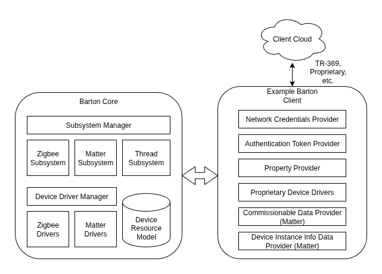

# Barton Device Service Overview

Barton is a sophisticated system that provides management, control, state change notifications,
and configuration of any kind of device with a common API and data model. Devices can use any
protocol and technology including Zigbee, Matter, and proprietary methods, without the Barton API
client's awareness. This design means clients can interact with devices without awareness of the
underlying technology or protocol. When new device support is added, clients can often gain the
new functionality without any changes.

Barton is appropriate for any device that controls other devices. If such a device is also
controlled by other devices, it is still appropriate. If a device is only controlled by other
devices and is not itself a controller, it probably is not the right solution.

Barton's API is GObject based and is self-documenting. It can be used to generate bindings for many
languages including C, C++, Python, Java, and JavaScript. The API is designed to be easy to use and
understand, making it accessible to developers of all skill levels.

# Device Data Model

Barton provides a common resource model for all devices. Resources can be read to determine the
current state, or written and executed to change the state of the device. As a device changes
state, resource changed events may be emitted. The resources available for each device and their
function is dictated by their composition which is defined and discoverable through Device Classes
and Endpoint Profiles.

## Composition through Device Classes and Endpoint Profiles

Devices belong to a Device Class which defines the type of device and acts as a contract for the
device's composition.  Some examples of Device Classes are Camera, Light, Door Lock, and Sensor
(and many others).  Each Device Class supports one or more endpoints, each of which belongs to an
Endpoint Profile which is a contract for the endpoint's composition.  An endpoint on a device can
be thought of as a port number in IP networking.  An endpoint provides a logical set of
functionality such as a light switch.  For example, a single physical device such as a refrigerator
could have endpoints for temperature, lights, door sensors, etc. This physical device would be
represented in the device model as a Refrigerator Device Class which is defined as having mandatory
endpoints for Endpoint Profiles Sensor (temperature), Light, and Sensor (contact switch). The
Device Class specification could also contain optional Endpoint Profiles for other features a
refrigerator may have — this is just an example.

### Device Class Specifications

TODO: document or link to specifications for each Device Class.

### Endpoint Profile Specifications

TODO: document or link to specifications for each Endpoint Profile

## Resources

Devices use a URI based resource model to expose
functionality.  One architectural goal of the resource model is to hide the
underlying technology that the device uses (Zigbee, Matter, etc.).  This allows
clients of devices to function without change against devices of any class and
to get automatic support for new devices once new subsystems and device drivers
are added.

Here are example resources and their values for a door/window sensor:

~~~
000d6f000f486af8: Bedroom 1 Window 2, Class: sensor
    /000d6f000f486af8/r/battVolts = 2700
    /000d6f000f486af8/r/communicationFailure = true
    /000d6f000f486af8/r/dateAdded = 1575386127578
    /000d6f000f486af8/r/dateLastContacted = 1579810368616
    /000d6f000f486af8/r/feLqi = 255
    /000d6f000f486af8/r/feRssi = -84
    /000d6f000f486af8/r/firmwareUpdateStatus = (null)
    /000d6f000f486af8/r/firmwareVersion = 0x20190422
    /000d6f000f486af8/r/hardwareVersion = 1
    /000d6f000f486af8/r/lowBatt = false
    /000d6f000f486af8/r/manufacturer = Universal Electronics Inc
    /000d6f000f486af8/r/model = URC4460BC0-X-R
    /000d6f000f486af8/r/neLqi = 243
    /000d6f000f486af8/r/neRssi = -54
    /000d6f000f486af8/r/resetToFactoryDefaults = (null)
    /000d6f000f486af8/r/temp = 1900
    Endpoint 1: Profile: sensor
        /000d6f000f486af8/ep/1/r/bypassed = false
        /000d6f000f486af8/ep/1/r/faulted = false
        /000d6f000f486af8/ep/1/r/label = Bedroom 1 Window 2
        /000d6f000f486af8/ep/1/r/qualified = true
        /000d6f000f486af8/ep/1/r/tampered = false
        /000d6f000f486af8/ep/1/r/type = contactSwitch
~~~

Some resources are read-only such as /000d6f000f486af8/r/battVolts.  Some
resources are executable such as /000d6f000f486af8/r/resetToFactoryDefaults.
Resources like /000d6f000f486af8/ep/1/r/label are read-writable.

Most resources will emit events when they change (broadcast locally from Device
Service to other interested services).  In this example when the door/window
sensor is opened /000d6f000f486af8/ep/1/r/faulted will change to 'true' and
SecurityService will get notified to take appropriate action.

Note that the relationship between resources and Zigbee attributes is not
always 1:1.

# Protocol Support

If a particular device technology or protocol requires some management or coordination with related
Device Drivers (described later), a corresponding Subsystem is provided by Barton. Subsystems are
not required if management or coordination is not needed, for example simple IP communication.
Below are the currently available Subsystems.

## Matter

Matter support is provided by the Matter Subsystem, which is responsible for:

* Initialization of the Matter SDK
* Operational Credentials Issuers
  * Self-signed certificates (for testing)
  * Comcast’s publicly available xPKI service
  * Other issuers through Barton’s helper abstractions
* Device Attestation Provider through Barton’s helper abstractions
* Simplified commissioner interface
* Device communication health monitoring
* Runtime property interface for easy and flexible storage options
* The Matter SDK’s gmain loop
* DCL retrieval (TBD)
* OTA firmware updates based on DCL entries (TBD)

## Zigbee

The Zigbee Subsystem interacts with the Zigbee Hardware Abstraction Layer (ZHAL) and is responsible
for:

* Initialization of the Zigbee network
* Backup and restore of the Zigbee network configuration (also useful for RMA scenarios)
* Zigbee network monitoring and statistics collection
* Interfaces for sending and receiving Zigbee messages, attribute reports, and stack events
* Device Descriptor List (DDL) processing (see Device Descriptor List section)
* OTA firmware updates based on DDL entries
* Device communication health monitoring

## Thread

The Thread Subsystem interacts with the OpenThread Border Router Agent in order to:

* Backup and restore the Thread network (useful for RMA scenarios)
* Border router status monitoring
* Thread network health monitoring (TBD)

## Proprietary

Barton does not currently contain implementations of proprietary Subsystems, however Barton’s
Subsystem Manager interface supports them if desired.

# Device Drivers

Device Drivers provide the mapping between Barton resources and over-the-air (or over-the-wire)
interactions with specific types of devices. They are responsible for implementing Device Classes
for a particular technology.  For example, MatterLightDeviceDriver and ZigbeeLightDeviceDriver are
two drivers that implement the same device class on different technology stacks. Drivers may or may
not depend upon a Subsystem.

Drivers are responsible for participating in the device discovery process and ‘claim’ discovered
devices through a matching process triggered after details of a device are discovered. Once a
driver claims the device, an entry is created, and persisted, representing the instance and
associated with the driver. Subsequent interactions with the device are performed through the
device driver. For example, Device Drivers supporting the Light Device Class are required to have a
resource on at least one Endpoint called “isOn”.  Writing “true” to this resource would result in
sending a command to the device over whatever technology/protocol is required to change the light’s
state to “on”.

The current set of drivers available in Barton are:

* MatterDoorLock
* MatterLight
* MatterWindowCovering
* philipsHue
* zigbeeDoorLock
* zigbeeLight
* zigbeeLightController
* zigbeePresence
* zigbeeSensor
* zigbeeThermostat
* zigbeeWindowCovering

# Hardware Dependencies

Device Service can function without any hardware dependencies, however its capabilities might be
reduced.  Below are the common potential hardware dependencies depending on configuration.

## Matter

Matter has no hardware requirements for basic functionality since it is an IPv6-based specification.
It can make use of Thread and BLE for commissioning of new devices, but after a device has been
commissioned for the first time (by any admin/Fabric), subsequent commissioning is performed only
over IPv6. Commissioned Thread devices communicate over IPv6 and could be routed from any Border
Router (on the same device as Barton or somewhere else on the network).
See [MATTER_SUPPORT.md](MATTER_SUPPORT.md) for more information.

## Zigbee

If Barton is built with Zigbee support, there should be an implementation of ZHAL, which is
the Zigbee Hardware Abstraction Layer defined by Barton. This HAL is an atypical HAL due to the
high-level application capabilities it is required to provide. The intent of ZHAL is to enable
portability to different Zigbee stack and silicon vendors. These stacks typically provide high-level
features such as OTA software updating; however, if a stack does not provide these features, the
ZHAL implementation must. See [ZIGBEE_SUPPORT.md](ZIGBEE_SUPPORT.md) for more information.

## Thread

If Device Service is built with Thread support, it will backup and restore configuration for a local
OpenThread Border Router instance. Additionally, it will retrieve and use the associated Thread
network credentials when commissioning Matter over Thread devices. Additional capabilities such as
detailed Thread network health monitoring, Thread 1.4 ephemeral code commissioning, and others are
anticipated enhancements. Device Service expects an OpenThread API over dbus. See
[THREAD_SUPPORT.md](THREAD_SUPPORT.md) for more information.

## Bluetooth/BLE

Barton does not directly depend on Bluetooth support. If the Matter support has Bluetooth enabled,
Matter devices may be commissioned directly for Thread or Wi-Fi Operational Network access. The
Matter stack expects a Bluez API over dbus on Linux.

# Device Descriptor List (DDL)

Note: The DDL currently only applies to Zigbee devices.

Zigbee devices that are allowed to be commissioned can be controlled through
an 'allow list' which consists of Device Descriptors for each allowed device.
This list is published to a content server and provided to Barton when it
changes.

When a Zigbee device joins the network as part of the pairing process Barton
reads its manufacturer name, model, hardware version, and firmware version.
These 4 attributes are used to locate the appropriate Device Descriptor.  If no
Descriptor is found, the device is rejected and told to leave the network.  An
example of a Device Descriptor is:

## Customized Configuration

TODO

~~~
<DeviceDescriptor>
   <uuid>f7d49c2b-7324-4857-96eb-cdee9a44d996</uuid>
   <description>ZigBee_Gen2_PIR_Std</description>
   <category>zigbee</category>
   <manufacturer>Bosch</manufacturer>
   <model>RFPR-ZB-MS</model>
   <hardwareVersions>19</hardwareVersions>
   <firmwareVersions>0x21115401,0x22115401,0x23115401,0x23125401,0x23125402</firmwareVersions>
   <latestFirmware>
      <version>0x23125402</version>
      <filename>Bosch_Motion_G2_V23125402.ota</filename>
      <type>ota</type>
   </latestFirmware>
</DeviceDescriptor>
~~~

As shown, the Device Descriptor also contains information about the latest
firmware for the device.  This is downloaded and supplied to the device if it
needs a firmware upgrade.

## Restricting Which Devices are Allowed

TODO

# Firmware Management

TODO

## Zigbee
Most Zigbee devices are compliant with the Over the Air Upgrade cluster's
firmware management mechanisms that were introduced with the Home Automation
profile version 1.2.

As mentioned in the Device Descriptor section, when a new firmware image is
available for a device, the Device Descriptor List (aka whitelist/allowlist) is
updated with the new firmware version number and filename.  When this updated
list is published and provided to Barton it is scanned for descriptors
matching paired devices.  If a paired device needs an upgrade its file is
downloaded from the content server.  This upgrade mechanism is
"pulled" from the device through image block requests made to the Zigbee stack.
The process starts when the device sends a "query next image" request which
contains its current firmware version.  The response will indicate if
the Zigbee stack has a newer image for it and the device will start pulling
blocks until it finishes.

This upgrade mechanism can take a while, especially on battery powered devices.
While the device is downloading the firmware image it remains fully functional
until the image is fully downloaded and verified at which point it reboots to
the new image.  Reboots typically take less than a second.

Note that once a firmware image for a device is downloaded an "image notify"
command is sent to the device in an attempt to start the upgrade immediately,
however many of our devices are "sleepy" so they will not receive this message.
Devices are required to check once a day, minimum, to see if the Zigbee stack
has a new firmware image available.

# Device Connectivity Monitoring
Barton has a component that is responsible for detecting communication
failure with the devices it manages.  Once the Device Communication Watchdog
determines that a device is in communication failure, the device's
communicationFailure resource (/000d6f000f486af8/r/communicationFailure from
the example device earlier) is set to "true".  This triggers a resource changed
event that can be handled by project specific business logic.

For Zigbee devices, the watchdog tracks the amount of time since the last
successful message to or from the device.  By default the watchdog will report
communication failure after 1 hour without any successful communication.  This
allows for two missed checkin intervals, which are configured for 27 minutes.

# Database
Device Service stores all of its configuration in individual files. An example
directory listing is:

~~~
000d6f000f2081e7  000d6f000f4839e3  000d6f000f4877bc  000d6f0010abe463  systemProperties
000d6f000f4525fb  000d6f000f486af8  000d6f000f6ca643  6cc1d2000052829b
~~~

Note that there will also be backup versions of these files ending in .bak
which were omitted here.

Each file, other than systemProperties represents a single device.  For Zigbee
devices the filenames are EUI64s for the corresponding device.  Below is an
example of a Zigbee sensor's database file contents.

~~~json
{
    "deviceDriver": "ZigBeeSensorDD",
    "deviceClass":  "sensor",
    "deviceClassVersion":   1,
    "uri":  "/000d6f000f2081e7",
    "uuid": "000d6f000f2081e7",
    "deviceEndpoints":  {
        "1":    {
            "uri":  "/000d6f000f2081e7/ep/1",
            "id":   "1",
            "profile":  "sensor",
            "enabled":  true,
            "profileVersion":   0,
            "resources":    {
                "faulted":  {
                    "id":   "faulted",
                    "uri":  "/000d6f000f2081e7/ep/1/r/faulted",
                    "mode": 57,
                    "cachingPolicy":    1,
                    "dateOfLastSyncMillis": 0,
                    "value":    "false",
                    "type": "com.icontrol.boolean"
                },
                "qualified":    {
                    "id":   "qualified",
                    "uri":  "/000d6f000f2081e7/ep/1/r/qualified",
                    "mode": 1,
                    "cachingPolicy":    1,
                    "dateOfLastSyncMillis": 0,
                    "value":    "true",
                    "type": "com.icontrol.boolean"
                },
                "bypassed": {
                    "id":   "bypassed",
                    "uri":  "/000d6f000f2081e7/ep/1/r/bypassed",
                    "mode": 35,
                    "cachingPolicy":    1,
                    "dateOfLastSyncMillis": 0,
                    "value":    "false",
                    "type": "com.icontrol.boolean"
                },
                "type": {
                    "id":   "type",
                    "uri":  "/000d6f000f2081e7/ep/1/r/type",
                    "mode": 1,
                    "cachingPolicy":    1,
                    "dateOfLastSyncMillis": 0,
                    "value":    "motion",
                    "type": "com.icontrol.sensorType"
                },
                "tampered": {
                    "id":   "tampered",
                    "uri":  "/000d6f000f2081e7/ep/1/r/tampered",
                    "mode": 57,
                    "cachingPolicy":    1,
                    "dateOfLastSyncMillis": 0,
                    "value":    "false",
                    "type": "com.icontrol.boolean"
                },
                "label":    {
                    "id":   "label",
                    "uri":  "/000d6f000f2081e7/ep/1/r/label",
                    "mode": 59,
                    "cachingPolicy":    1,
                    "dateOfLastSyncMillis": 0,
                    "value":    "Master Bedroom Motion",
                    "type": "com.icontrol.label"
                }
            },
            "metadatas":    {
                "zigbee_epid":  {
                    "id":   "zigbee_epid",
                    "uri":  "/000d6f000f2081e7/ep/1/m/zigbee_epid",
                    "value":    "1"
                },
                "migratedUserProperties":   {
                    "id":   "migratedUserProperties",
                    "uri":  "/000d6f000f2081e7/ep/1/m/migratedUserProperties",
                    "value":    {
                        "Zone.SensorId":    "29",
                        "Zone.FunctionType":    "10",
                        "Zone.ZoneType":    "3",
                        "orderIndex":   "18",
                        "Zone.Edited":  "true",
                        "Zone.Bypassed":    "false",
                        "Zone.TestMode":    "false",
                        "NearEndLqi":   "255",
                        "Zone.ZoneNumber":  "32",
                        "label":    "Master Bedroom Motion",
                        "NearEndRssi":  "-54",
                        "Zone.SwingerShutdown": "false",
                        "IASZoneStatus":    "32"
                    }
                },
                "migrationAlias":   {
                    "id":   "migrationAlias",
                    "uri":  "/000d6f000f2081e7/ep/1/m/migrationAlias",
                    "value":    "000d6f000f2081e7.1"
                },
                "secZone":  {
                    "id":   "secZone",
                    "uri":  "/000d6f000f2081e7/ep/1/m/secZone",
                    "value":    {
                        "zoneNumber":   32,
                        "sensorId": 29,
                        "displayIndex": 5,
                        "isTroubled":   false,
                        "isConfigured": true,
                        "inSwingerShutdown":    false,
                        "isInTestMode": false,
                        "isWirelessDevice": false,
                        "isBatteryDevice":  false,
                        "hasTemperature":   false,
                        "zoneType": 3,
                        "zoneFunction": 10,
                        "zoneMute": 0
                    }
                }
            }
        }
    },
    "deviceResources":  {
        "manufacturer": {
            "id":   "manufacturer",
            "uri":  "/000d6f000f2081e7/r/manufacturer",
            "mode": 1,
            "cachingPolicy":    1,
            "dateOfLastSyncMillis": 0,
            "value":    "Visonic",
            "type": "com.icontrol.string"
        },
        "model":    {
            "id":   "model",
            "uri":  "/000d6f000f2081e7/r/model",
            "mode": 1,
            "cachingPolicy":    1,
            "dateOfLastSyncMillis": 0,
            "value":    "MP-841",
            "type": "com.icontrol.string"
        },
        "hardwareVersion":  {
            "id":   "hardwareVersion",
            "uri":  "/000d6f000f2081e7/r/hardwareVersion",
            "mode": 1,
            "cachingPolicy":    1,
            "dateOfLastSyncMillis": 0,
            "value":    "1",
            "type": "com.icontrol.version"
        },
        "firmwareVersion":  {
            "id":   "firmwareVersion",
            "uri":  "/000d6f000f2081e7/r/firmwareVersion",
            "mode": 57,
            "cachingPolicy":    1,
            "dateOfLastSyncMillis": 0,
            "value":    "0x00000025",
            "type": "com.icontrol.version"
        },
        "firmwareUpdateStatus": {
            "id":   "firmwareUpdateStatus",
            "uri":  "/000d6f000f2081e7/r/firmwareUpdateStatus",
            "mode": 57,
            "cachingPolicy":    1,
            "dateOfLastSyncMillis": 0,
            "value":    "upToDate",
            "type": "com.icontrol.firmwareVersionStatus"
        },
        "dateAdded":    {
            "id":   "dateAdded",
            "uri":  "/000d6f000f2081e7/r/dateAdded",
            "mode": 1,
            "cachingPolicy":    1,
            "dateOfLastSyncMillis": 0,
            "value":    "1516290469399",
            "type": "com.icontrol.dateTime"
        },
        "dateLastContacted":    {
            "id":   "dateLastContacted",
            "uri":  "/000d6f000f2081e7/r/dateLastContacted",
            "mode": 89,
            "cachingPolicy":    1,
            "dateOfLastSyncMillis": 0,
            "value":    "1579809077821",
            "type": "com.icontrol.dateTime"
        },
        "communicationFailure": {
            "id":   "communicationFailure",
            "uri":  "/000d6f000f2081e7/r/communicationFailure",
            "mode": 57,
            "cachingPolicy":    1,
            "dateOfLastSyncMillis": 1582149774116,
            "value":    "true",
            "type": "com.icontrol.trouble"
        },
        "resetToFactoryDefaults":   {
            "id":   "resetToFactoryDefaults",
            "uri":  "/000d6f000f2081e7/r/resetToFactoryDefaults",
            "mode": 4,
            "cachingPolicy":    0,
            "dateOfLastSyncMillis": 0,
            "type": "com.icontrol.resetToFactoryOperation"
        },
        "feRssi":   {
            "id":   "feRssi",
            "uri":  "/000d6f000f2081e7/r/feRssi",
            "mode": 89,
            "cachingPolicy":    1,
            "dateOfLastSyncMillis": 0,
            "value":    "-51",
            "type": "rssi"
        },
        "feLqi":    {
            "id":   "feLqi",
            "uri":  "/000d6f000f2081e7/r/feLqi",
            "mode": 89,
            "cachingPolicy":    1,
            "dateOfLastSyncMillis": 0,
            "value":    "255",
            "type": "lqi"
        },
        "neRssi":   {
            "id":   "neRssi",
            "uri":  "/000d6f000f2081e7/r/neRssi",
            "mode": 89,
            "cachingPolicy":    1,
            "dateOfLastSyncMillis": 0,
            "value":    "-54",
            "type": "rssi"
        },
        "neLqi":    {
            "id":   "neLqi",
            "uri":  "/000d6f000f2081e7/r/neLqi",
            "mode": 89,
            "cachingPolicy":    1,
            "dateOfLastSyncMillis": 0,
            "value":    "255",
            "type": "lqi"
        },
        "temp": {
            "id":   "temp",
            "uri":  "/000d6f000f2081e7/r/temp",
            "mode": 89,
            "cachingPolicy":    1,
            "dateOfLastSyncMillis": 0,
            "value":    "1900",
            "type": "com.icontrol.temperature"
        },
        "lowBatt":  {
            "id":   "lowBatt",
            "uri":  "/000d6f000f2081e7/r/lowBatt",
            "mode": 57,
            "cachingPolicy":    1,
            "dateOfLastSyncMillis": 0,
            "value":    "false",
            "type": "com.icontrol.boolean"
        },
        "battVolts":    {
            "id":   "battVolts",
            "uri":  "/000d6f000f2081e7/r/battVolts",
            "mode": 121,
            "cachingPolicy":    1,
            "dateOfLastSyncMillis": 0,
            "value":    "3000",
            "type": "battery.voltage"
        }
    },
    "metadatas":    {
        "discoveredDetails":    {
            "id":   "discoveredDetails",
            "uri":  "/000d6f000f2081e7/m/discoveredDetails",
            "value":    {
                "eui64":    "000d6f000f2081e7",
                "manufacturer": "Visonic",
                "model":    "MP-841",
                "hwVer":    1,
                "fwVer":    37,
                "appVer":   1,
                "type": "unknown",
                "power":    "unknown",
                "endpoints":    [{
                        "id":   1,
                        "profileId":    260,
                        "deviceId": 1026,
                        "deviceVer":    0,
                        "serverClusterInfos":   [{
                                "id":   2821,
                                "isServer": true,
                                "attributeIds": [283, 284, 285]
                            }, {
                                "id":   0,
                                "isServer": true,
                                "attributeIds": [0, 1, 2, 3, 4, 5, 7]
                            }, {
                                "id":   1,
                                "isServer": true,
                                "attributeIds": [62, 32, 49, 51, 54, 55, 56, 57]
                            }, {
                                "id":   32,
                                "isServer": true,
                                "attributeIds": [1, 2, 3, 4, 6, 0]
                            }, {
                                "id":   1280,
                                "isServer": true,
                                "attributeIds": [0, 16, 1, 17, 2]
                            }, {
                                "id":   3,
                                "isServer": true,
                                "attributeIds": [0]
                            }, {
                                "id":   1026,
                                "isServer": true,
                                "attributeIds": [0, 1, 2]
                            }],
                        "clientClusterInfos":   [{
                                "id":   25,
                                "isServer": false,
                                "attributeIds": [0, 1, 2, 4, 6, 7, 8, 9, 10]
                            }]
                    }]
            }
        },
        "migratedDevice":   {
            "id":   "migratedDevice",
            "uri":  "/000d6f000f2081e7/m/migratedDevice",
            "value":    "true"
        },
        "lpmPolicy":    {
            "id":   "lpmPolicy",
            "uri":  "/000d6f000f2081e7/m/lpmPolicy",
            "value":    "armedAway"
        },
        "troubles": {
            "id":   "troubles",
            "uri":  "/000d6f000f2081e7/m/troubles",
            "value":    {
                "32548":    {
                    "_evId":    32543,
                    "_evCode":  255,
                    "_evVal":   0,
                    "_evTime":  1582149774139,
                    "troubleEvent": {
                        "trouble":  {
                            "troubleObj":   {
                                "description":  "sensor TROUBLE_REASON_COMM_FAIL",
                                "eventId":  32543,
                                "troubleId":    32548,
                                "acknowledged": false,
                                "restored": false,
                                "treatAsLifeSafety":    false,
                                "eventTime":    1582149774139,
                                "type": 5,
                                "reason":   4,
                                "critical": 2,
                                "indicationGroup":  1,
                                "indication":   3,
                                "extra":    {
                                    "rootId":   "000d6f000f2081e7",
                                    "ownerUri": "/000d6f000f2081e7",
                                    "resourceUri":  "/000d6f000f2081e7/r/communicationFailure",
                                    "deviceClass":  "sensor",
                                    "zoneNumber":   32,
                                    "zoneType": 3,
                                    "alarmArmType": 0,
                                    "alarmStatusType":  0
                                }
                            }
                        },
                        "panelStatus":  {
                            "systemPanelStatus":    {
                                "testModeSecsRemaining":    0,
                                "trouble":  true,
                                "bypassActive": false,
                                "alarmStatus":  2,
                                "armMode":  0
                            }
                        },
                        "alarm":    {
                            "alarmDetails": {
                                "contactId":    "138101005",
                                "alarmSessionId":   0,
                                "sendImmediately":  false,
                                "isZoneInSwingerShutdown":  false,
                                "isDuressCodeAlarm":    false,
                                "isExitError":  false,
                                "isRecentClosing":  false,
                                "isWithinCancelWindow": false,
                                "isZonesFaulted":   false,
                                "alarmReason":  0
                            }
                        }
                    }
                }
            }
        }
    }
}
~~~

The systemProperties file contains some Device Service specific configuration
details.  For example:

~~~json
{
    "ZIGBEE_INCREMENT_COUNTERS_ON_NEXT_INIT":   "false",
    "zigbeeTelemetryStartDate": "1588944626812",
    "currentDeviceDescriptorUrl":   "https://example-server.com/DevicesAllowed.xml",
    "currentDenylistMd5":  "e4999307cad3e2df24e46a0e4245a725",
    "ZIGBEE_NETWORK_CONFIG_DATA":   "oxMAAAQQAAAULkZFblsJTyShkzLZS/SvAAAAAAAAAAAAAAAAAAAAAAAAKUQDGQIBAABZsmTDjXOEauQQwl8Pn4utGwCaC297bXQGPhLSmvl/jF0KAPj/BwAAAAA=",
    "ZIGBEE_LOCAL_EUI64":   "001bad8b9f0f5fc2",
    "schemaVersion":    "1",
    "ZIGBEE_REJECT_UNKNOWN_DEVICES":    "true",
    "currentBlacklistUrl":  "https://example-server.com/blacklist-nothing.xml",
    "deviceDescriptorBypass":   "false",
    "currentDeviceDescriptorMd5":   "95c55b67c9cfe93318be19c7a6eab752"
}
~~~
